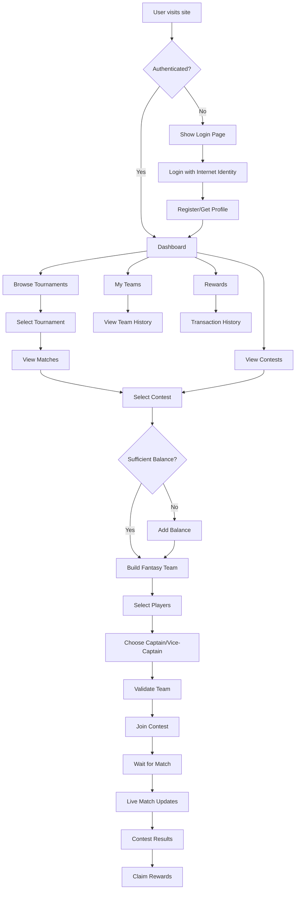
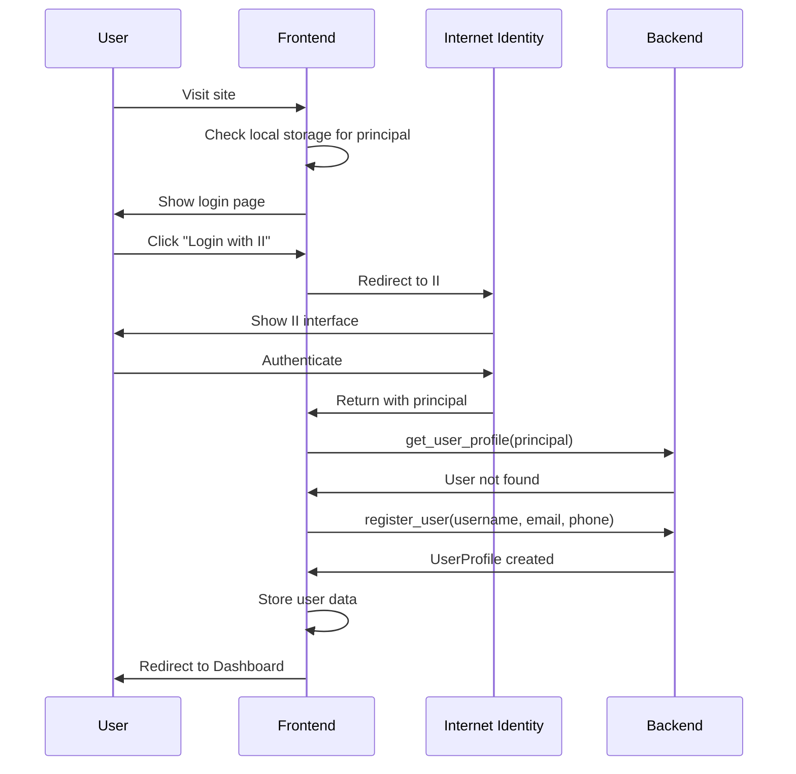
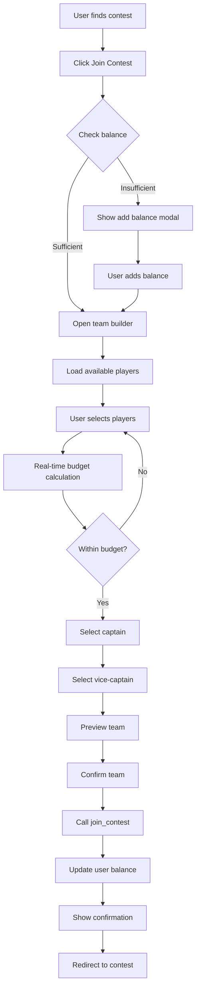
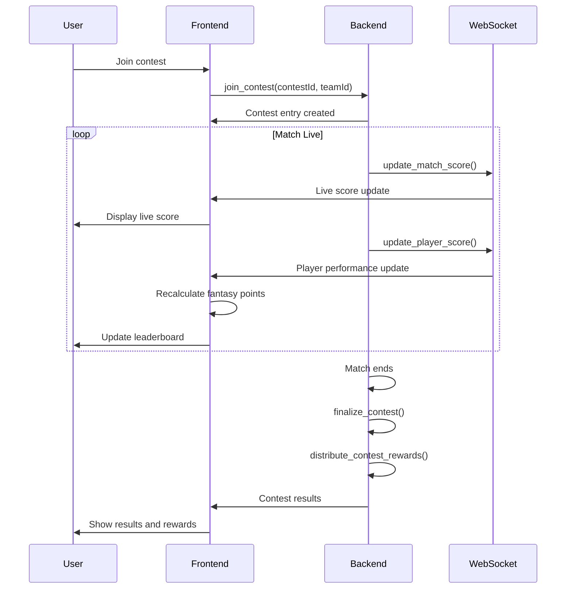
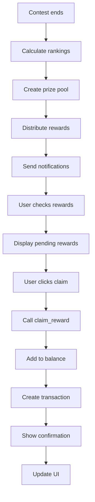

# User Flow Diagrams & Wireframes

## 1. Main User Journey Flow



## 2. Authentication Flow



## 3. Contest Participation Flow



## 4. Live Match Flow



## 5. Rewards Flow



## Wireframe Mockups

### 1. Dashboard Layout

```
┌─────────────────────────────────────────────────────────────┐
│ Header: Logo | Balance: 1000 | Notifications: 3 | Profile ▼ │
├─────────────────────────────────────────────────────────────┤
│                                                             │
│  Welcome back, John!                                        │
│  ┌─────────────┐ ┌─────────────┐ ┌─────────────┐           │
│  │ Total Wins  │ │ Total Winnings│ │ Active Contests│       │
│  │    15       │ │   5000      │ │     3       │           │
│  └─────────────┘ └─────────────┘ └─────────────┘           │
│                                                             │
│  Recent Contests                                            │
│  ┌─────────────────────────────────────────────────────────┐ │
│  │ IPL Match 1 - 2nd Place - Won 500 credits              │ │
│  │ Premier League - 1st Place - Won 1000 credits          │ │
│  └─────────────────────────────────────────────────────────┘ │
│                                                             │
│  Upcoming Matches                                           │
│  ┌─────────────────────────────────────────────────────────┐ │
│  │ MI vs CSK - Today 7:30 PM - Join Contest               │ │
│  │ RCB vs KKR - Tomorrow 3:30 PM - Join Contest           │ │
│  └─────────────────────────────────────────────────────────┘ │
│                                                             │
└─────────────────────────────────────────────────────────────┘
```

### 2. Tournament List

```
┌─────────────────────────────────────────────────────────────┐
│ Tournaments                    [Search] [Filter ▼] [Sort ▼] │
├─────────────────────────────────────────────────────────────┤
│                                                             │
│  ┌─────────────────────────────────────────────────────────┐ │
│  │ 🏏 IPL 2024                                              │ │
│  │ Status: Live | Teams: 10 | Matches: 74                  │ │
│  │ [View Details] [Join Contest]                           │ │
│  └─────────────────────────────────────────────────────────┘ │
│                                                             │
│  ┌─────────────────────────────────────────────────────────┐ │
│  │ ⚽ Premier League 2024                                   │ │
│  │ Status: Upcoming | Teams: 20 | Matches: 380             │ │
│  │ [View Details] [Join Contest]                           │ │
│  └─────────────────────────────────────────────────────────┘ │
│                                                             │
│  ┌─────────────────────────────────────────────────────────┐ │
│  │ 🏀 NBA Playoffs 2024                                     │ │
│  │ Status: Completed | Teams: 16 | Matches: 105            │ │
│  │ [View Details] [View Results]                           │ │
│  └─────────────────────────────────────────────────────────┘ │
│                                                             │
└─────────────────────────────────────────────────────────────┘
```

### 3. Contest Selection

```
┌─────────────────────────────────────────────────────────────┐
│ MI vs CSK - Contests                                        │
├─────────────────────────────────────────────────────────────┤
│                                                             │
│  ┌─────────────────────────────────────────────────────────┐ │
│  │ Head to Head                                             │ │
│  │ Entry Fee: 100 | Prize Pool: 180 | Spots: 2/2           │ │
│  │ [Join Contest]                                           │ │
│  └─────────────────────────────────────────────────────────┘ │
│                                                             │
│  ┌─────────────────────────────────────────────────────────┐ │
│  │ Multi Player (50 spots)                                  │ │
│  │ Entry Fee: 50 | Prize Pool: 2250 | Spots: 35/50         │ │
│  │ [Join Contest]                                           │ │
│  └─────────────────────────────────────────────────────────┘ │
│                                                             │
│  ┌─────────────────────────────────────────────────────────┐ │
│  │ Winner Takes All                                         │ │
│  │ Entry Fee: 200 | Prize Pool: 1800 | Spots: 8/10         │ │
│  │ [Join Contest]                                           │ │
│  └─────────────────────────────────────────────────────────┘ │
│                                                             │
└─────────────────────────────────────────────────────────────┘
```

### 4. Team Builder

```
┌─────────────────────────────────────────────────────────────┐
│ Build Your Team - Budget: 1000/1000                        │
├─────────────────────────────────────────────────────────────┤
│                                                             │
│  ┌─────────────────┐ ┌─────────────────┐ ┌─────────────────┐ │
│  │ Wicket Keeper   │ │ Batsmen         │ │ All Rounders    │ │
│  │                 │ │                 │ │                 │ │
│  │ [MS Dhoni]      │ │ [Rohit Sharma]  │ │ [Hardik Pandya] │ │
│  │ Price: 100      │ │ Price: 150      │ │ Price: 120      │ │
│  │ [KL Rahul]      │ │ [Virat Kohli]   │ │ [Ravindra Jadeja]│ │
│  │ Price: 120      │ │ Price: 180      │ │ Price: 110      │ │
│  └─────────────────┘ └─────────────────┘ └─────────────────┘ │
│                                                             │
│  ┌─────────────────┐ ┌─────────────────┐                    │
│  │ Bowlers         │ │ Captain/Vice    │                    │
│  │                 │ │ Captain         │                    │
│  │ [Jasprit Bumrah]│ │ Captain: [Rohit]│                    │
│  │ Price: 130      │ │ Vice: [Virat]   │                    │
│  │ [Mohammed Shami]│ │                 │                    │
│  │ Price: 110      │ │                 │                    │
│  └─────────────────┘ └─────────────────┘                    │
│                                                             │
│  [Preview Team] [Join Contest]                              │
│                                                             │
└─────────────────────────────────────────────────────────────┘
```

### 5. Live Match View

```
┌─────────────────────────────────────────────────────────────┐
│ Live: MI vs CSK - 15.2 overs                                │
├─────────────────────────────────────────────────────────────┤
│                                                             │
│  ┌─────────────────────────────────────────────────────────┐ │
│  │ MI: 145/4 (15.2) | CSK: Yet to bat                      │ │
│  │ Rohit Sharma: 45(32) | Hardik Pandya: 12(8)             │ │
│  └─────────────────────────────────────────────────────────┘ │
│                                                             │
│  Contest Leaderboard                                        │
│  ┌─────────────────────────────────────────────────────────┐ │
│  │ 1. User123 - 125.5 points                               │ │
│  │ 2. FantasyKing - 118.2 points                           │ │
│  │ 3. YourTeam - 112.8 points                              │ │
│  │ 4. CricketLover - 98.5 points                           │ │
│  └─────────────────────────────────────────────────────────┘ │
│                                                             │
│  Your Team Performance                                      │
│  ┌─────────────────────────────────────────────────────────┐ │
│  │ Rohit Sharma (C): 90.0 points                           │ │
│  │ Virat Kohli (VC): 67.5 points                           │ │
│  │ Jasprit Bumrah: 45.0 points                             │ │
│  │ Total: 202.5 points                                     │ │
│  └─────────────────────────────────────────────────────────┘ │
│                                                             │
└─────────────────────────────────────────────────────────────┘
```

### 6. Rewards Page

```
┌─────────────────────────────────────────────────────────────┐
│ Rewards & Transactions                                      │
├─────────────────────────────────────────────────────────────┤
│                                                             │
│  Pending Rewards                                            │
│  ┌─────────────────────────────────────────────────────────┐ │
│  │ IPL Match 1 - 1st Place - 500 credits [Claim]          │ │
│  │ Premier League - 2nd Place - 250 credits [Claim]       │ │
│  │ NBA Contest - 3rd Place - 100 credits [Claim]          │ │
│  └─────────────────────────────────────────────────────────┘ │
│                                                             │
│  Transaction History                                        │
│  ┌─────────────────────────────────────────────────────────┐ │
│  │ 2024-03-15: Contest Win +500 credits                   │ │
│  │ 2024-03-14: Contest Entry -100 credits                 │ │
│  │ 2024-03-13: Deposit +1000 credits                      │ │
│  │ 2024-03-12: Contest Win +300 credits                   │ │
│  └─────────────────────────────────────────────────────────┘ │
│                                                             │
│  Total Winnings: 2,500 credits                             │
│  Total Deposits: 1,000 credits                             │
│  Net Profit: 1,500 credits                                 │
│                                                             │
└─────────────────────────────────────────────────────────────┘
```

## Mobile Responsive Considerations

### Mobile Dashboard
```
┌─────────────────┐
│ [Menu] Logo [II]│
├─────────────────┤
│ Welcome, John!  │
│                 │
│ ┌─────────────┐ │
│ │ Balance     │ │
│ │ 1000        │ │
│ └─────────────┘ │
│                 │
│ Quick Actions   │
│ [Join Contest]  │
│ [My Teams]      │
│ [Rewards]       │
│                 │
│ Recent Activity │
│ • Won 500       │
│ • Lost 100      │
│ • Joined IPL    │
└─────────────────┘
```

### Mobile Team Builder
```
┌─────────────────┐
│ Team Builder    │
│ Budget: 800/1000│
├─────────────────┤
│                 │
│ [Wicket Keeper] │
│ [Batsmen]       │
│ [All Rounders]  │
│ [Bowlers]       │
│                 │
│ Selected: 8/11  │
│ Captain: Rohit  │
│ Vice: Virat     │
│                 │
│ [Preview] [Join]│
└─────────────────┘
```

## Key Interaction Patterns

### 1. Swipe Gestures (Mobile)
- **Swipe left/right**: Navigate between tournaments
- **Swipe up**: Refresh contest list
- **Swipe down**: Pull to refresh
- **Long press**: Quick actions menu

### 2. Touch Interactions
- **Tap**: Select item
- **Double tap**: Quick join contest
- **Pinch**: Zoom in/out on match details
- **Swipe**: Dismiss notifications

### 3. Loading States
- **Skeleton screens**: For initial loading
- **Progress bars**: For team building
- **Spinners**: For API calls
- **Pull to refresh**: For live updates

### 4. Error Handling
- **Offline mode**: Show cached data
- **Retry buttons**: For failed API calls
- **Error boundaries**: Graceful degradation
- **Toast notifications**: User feedback

This comprehensive user flow design ensures a smooth, intuitive experience across all devices and user scenarios. 